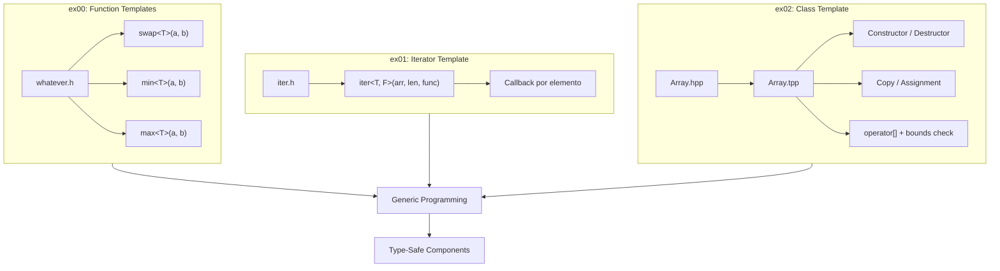

<div align="center">

# CPP Module 07 - C++ Templates

[](https://isocpp.org/)
[](https://en.cppreference.com/w/cpp/language/templates)
[](https://en.cppreference.com/w/cpp/language/raii)
[](https://42.fr/)

</div>

Implementación avanzada de **Templates C++** desarrollando componentes genéricos type-safe que demuestran dominio de metaprogramación, gestión de memoria RAII y las mejores prácticas del lenguaje.

---

## Características Principales

- **Function Templates**: Implementación genérica de `swap`, `min` y `max` que operan con cualquier tipo comparable
- **Iterator Template**: Función `iter` que aplica callbacks a arrays sin importar su tipo subyacente
- **Class Template Array**: Container genérico con gestión de memoria automática (RAII) y bounds checking
- **Orthodox Canonical Form**: Copy constructor, assignment operator y destructor implementados correctamente
- **Exception Safety**: Manejo robusto de out-of-bounds mediante `std::out_of_range`

---

## Stack Tecnológico

| Componente | Tecnología |
|------------|------------|
| Lenguaje | C++98 |
| Compilador | c++ (clang/g++) |
| Paradigma | Generic Programming / Metaprogramming |
| Memoria | RAII (Resource Acquisition Is Initialization) |
| Safety | Exception Handling, Bounds Checking |

---

## Decisiones Técnicas

El proyecto implementa templates siguiendo el estándar **C++98** para garantizar máxima portabilidad y compatibilidad. La separación de declaración (`Array.hpp`) e implementación (`Array.tpp`) en templates demuestra comprensión profunda del **modelo de compilación de C++**. El patrón RAII previene memory leaks de forma automática, mientras que el bounds checking con excepciones proporciona **seguridad en tiempo de ejecución** sin sacrificar performance. El Orthodox Canonical Form asegura semántica de copia correcta (deep copy), fundamental para containers genéricos que gestionan memoria dinámica.

---

## Arquitectura



---

## Estructura del Proyecto

```
CPP-MODULE-07/
├── ex00/
│   ├── Makefile
│   ├── main.cpp
│   └── whatever.h          # Function templates: swap, min, max
├── ex01/
│   ├── Makefile
│   ├── main.cpp
│   └── iter.h              # Generic iterator template
└── ex02/
    ├── Makefile
    ├── main.cpp
    ├── Array.hpp           # Array template declaration
    └── Array.tpp           # Array template implementation
```

---

## Instalación y Ejecución

```bash
# Clonar el repositorio
git clone https://github.com/samuelhm/CPP-MODULE-07.git
cd CPP-MODULE-07

# Exercise 00 - Function Templates
cd ex00 && make && ./Template

# Exercise 01 - Iterator Template  
cd ../ex01 && make && ./Iter

# Exercise 02 - Array Class Template
cd ../ex02 && make && ./Arr
```

---

## Ejemplos de Uso

```cpp
// Function templates - tipos deducidos automáticamente
int a = 2, b = 3;
swap(a, b);              // a=3, b=2
min(a, b);               // returns 2
max(a, b);               // returns 3

// Iterator template - aplica función a cada elemento
int arr[] = {1, 2, 3, 4, 5};
iter(arr, 5, printElement<int>);    // Imprime cada elemento

// Array class template - container genérico con RAII
Array<std::string> names(5);
names[0] = "Hello";
std::cout << names.size();          // 5
// Excepción si: names[10]           → std::out_of_range
```

---

## Aprendizajes Clave

| Concepto | Descripción |
|----------|-------------|
| Type Deduction | Compilador deduce tipos automáticamente en templates |
| Template Instantiation | Separación declaración/implementación para headers |
| RAII Pattern | Gestión automática de recursos via constructor/destructor |
| Deep Copy Semantics | Copy constructor y assignment operator correctos |
| Exception Handling | Uso de `std::out_of_range` para errores runtime |

---

## Testeos y Validaciones

- Compilación con flags estrictos: `-Wall -Werror -Wextra -pedantic`
- Sanitizer Address habilitado: `-fsanitize=address`
- Tests con tipos primitivos (`int`, `double`) y complejos (`std::string`)
- Validación de bounds checking y excepciones

---

<div align="center">

## Contacto

[](https://github.com/samuelhm/)
[](https://www.linkedin.com/in/shurtado-m/)

</div>