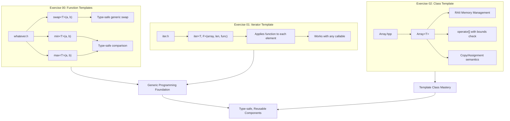

README.md creado exitosamente para CPP-MODULE-07. Incluye:

- Badges: C++98, Templates, Memory Management, Exception Safety, 42 School
- Descripción centrada en el dominio de templates genéricos
- Features: Function Templates, Iterator Genérico, Array Class Template con RAII
- Arquitectura Mermaid mostrando los 3 ejercicios y su relación con Generic Programming
- Guía de instalación con comandos make para cada ejercicio
- Sección de contacto conenlaces a GitHub y LinkedIn
 en el dominio de **Templates en C++**, desarrollando componentes genéricos type-safe que demuestran comprensión profunda de metaprogramación, gestión de memoria y las mejores prácticas del lenguaje.

## Características Principales

- **Function Templates**: Implementación de `swap`, `min` y `max` genéricos que operan con cualquier tipo comparable
- **Iterador Genérico**: Función `iter` que aplica callbacks a cada elemento de un array sin importar su tipo
- **Template Class Array**: Container genérico con gestión de memoria RAII, bounds checking y Orthodox Canonical Form completo
- **Exception Safety**: Manejo robusto de out-of-bounds mediante `std::out_of_range`

## Stack Tecnológico

| Componente | Tecnología |
|------------|------------|
| Lenguaje | C++98 |
| Compilador | c++ (clang/g++) |
| Paradigma | Generic Programming / Metaprogramming |
| Funcionalidades | Templates, RAII, Exceptions, Operator Overloading |

## Decisiones Técnicas

El proyecto implementa templates siguiendo el estándar C++98 para garantizar máxima portabilidad. La separación de declaración (`Array.hpp`) e implementación (`Array.tpp`) en templates demuestra comprensión del modelo de compilación de C++. El uso de RAII para gestión automática de memoria previene leaks, mientras que el bounds checking con excepciones proporciona seguridad sin sacrificar rendimiento. El Orthodox Canonical Form asegura semántica de copia correcta, fundamental para containers genéricos.

## Arquitectura



## Estructura del Proyecto

```
CPP-MODULE-07/
├── ex00/
│   ├── Makefile
│   ├── main.cpp
│   └── whatever.h        # Function templates: swap, min, max
├── ex01/
│   ├── Makefile
│   ├── main.cpp
│   └── iter.h            # Generic iterator template
└── ex02/
    ├── Makefile
    ├── main.cpp
    ├── Array.hpp         # Array template declaration
    └── Array.tpp         # Array template implementation
```

## Instalación y Ejecución

```bash
# Clonar el repositorio
git clone https://github.com/samuelhm/CPP-MODULE-07.git
cd CPP-MODULE-07

# Ejecutar Exercise 00 (Function Templates)
cd ex00 && make && ./Template

# Ejecutar Exercise 01 (Iterator Template)
cd ../ex01 && make && ./Iter

# Ejecutar Exercise 02 (Array Class Template)
cd ../ex02 && make && ./Arr
```

## Ejemplos de Uso

```cpp
// Function templates
int a = 2, b = 3;
swap(a, b);        // a=3, b=2
min(a, b);         // returns 2

// Iterator template
int arr[] = {1, 2, 3, 4, 5};
iter(arr, 5, printElement<int>);

// Array class template
Array<std::string> strArray(5);
strArray[0] = "Hello";
std::cout << strArray.size();  // 5
```

## Aprendizajes Clave

- **Type Deduction**: Comprensión de cómo el compilador deduce tipos en templates
- **Template Instantiation**: Separación de declaración e implementación
- **RAII Pattern**: Gestión automática de recursos con constructores/destructores
- **Deep Copy Semantics**: Implementación correcta de copy constructor y assignment operator
- **Exception Handling**: Uso de excepciones estándar para errores en tiempo de ejecución

---

## Contacto

<div align="center">

[](https://github.com/samuelhm/)
[](https://www.linkedin.com/in/shurtado-m/)

</div>